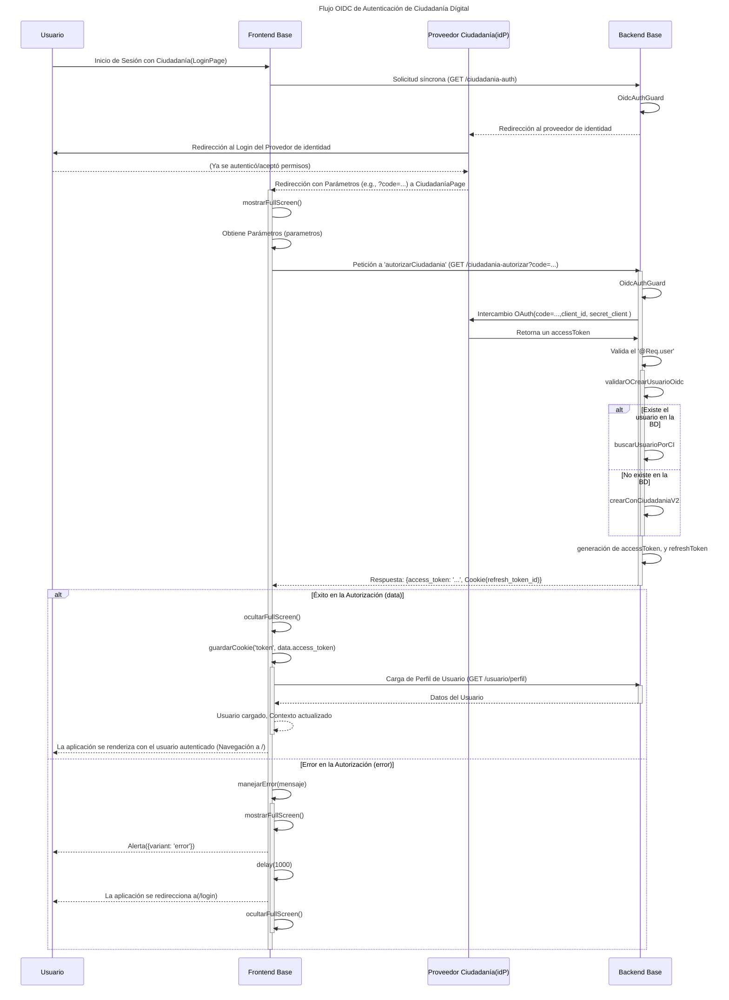

# Proyecto Backend Base

## Login con el Proveedor de Ciudadanía

Para la autenticación mediante el Proveedor de Ciudadanía Digital, es requisito indispensable que el cliente, en este caso el Backend Base, tenga configurado el Mecanismo de autenticación en el Módulo de Developer.
Los valores generados y configurados en el Módulo de Developer deberán utilizarse para sustituir los valores por defecto de la _configuración de integración con Ciudadanía Digital_, ubicados en el archivo `.env`, tal como se detalla a continuación.

- `OIDC_ISSUER`=<ISSUES_DEVELOPER>
- `OIDC_CLIENT_ID`=<OIDC_CLIENT_ID>
- `OIDC_CLIENT_SECRET`=<OIDC_CLIENT_SECRET>
- `OIDC_SCOPE`=<OIDC_SCOPE>
- `OIDC_REDIRECT_URI`=<OIDC_REDIRECT_URI>
- `OIDC_POST_LOGOUT_REDIRECT_URI`=<OIDC_POST_LOGOUT_REDIRECT_URI>
- `SESSION_SECRET`=<SESSION_SECRET>

Mas info: https://developer.ciudadaniadigital.bo/docs/empezar/registrar-mecanismo/autenticacion

### Flujo de autenticación OIDC con el Proveedor de Ciudadanía Digital

